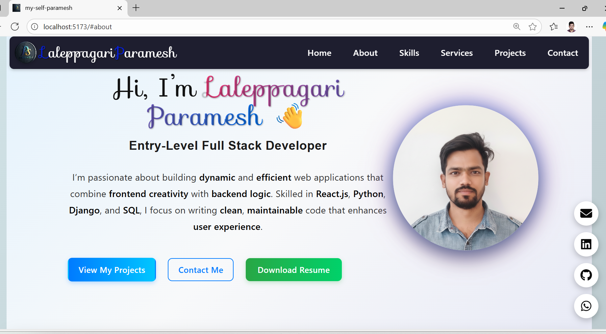
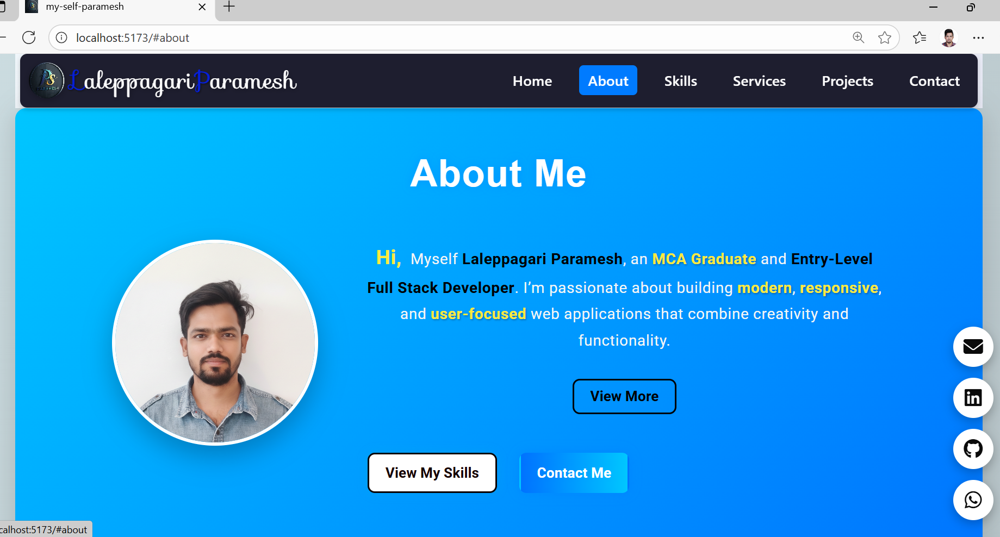
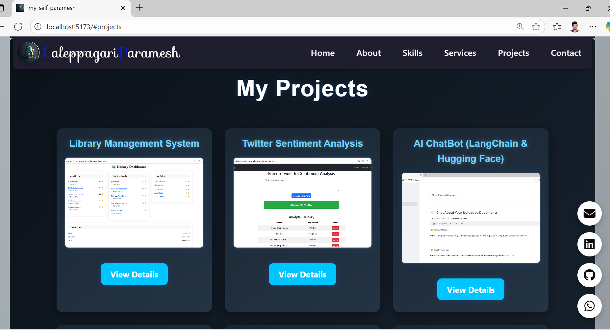
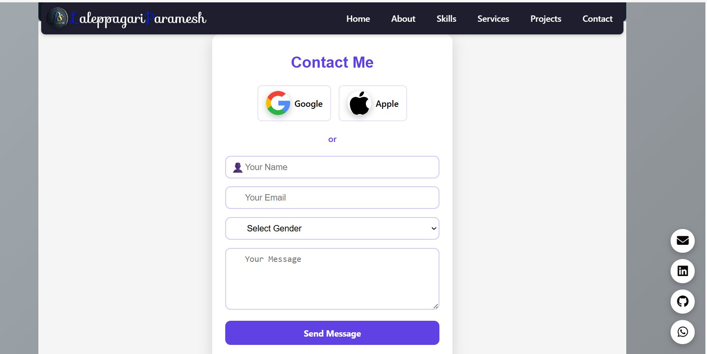

## 🌐 Laleppagari Paramesh | Entry-Level Full Stack Developer Portfolio
# --------------------------------------------------------------------------
Welcome to my personal **Portfolio Website**, built using **React.js**.  
This portfolio showcases my **skills, projects, education, and services**, designed with a modern and professional UI to give a clean and responsive experience.  

> “Turning ideas into interactive digital experiences.”

## 🧭 Table of Contents
1. [About the Portfolio](#about-the-portfolio)
2. [Tech Stack](#tech-stack)
3. [Website Structure](#website-structure)
   - [Navbar](#navbar)
   - [Home Section](#home-section)
   - [About Section](#about-section)
   - [Skills Section](#skills-section)
   - [Services Section](#services-section)
   - [Projects Section](#projects-section)
   - [Contact Section](#contact-section)
   - [Footer](#footer)
4. [Screenshots](#screenshots)
5. [Deployment](#deployment)
6. [Contact](#contact)

# -----------------------------------------------------------
## 💡 About the Portfolio
# ----------------------------------------------------------
This portfolio represents **who I am as a developer** — my learning journey, my technical capabilities, and the projects I’ve built using various technologies.  
It’s fully **responsive**, designed to look elegant on both desktop and mobile devices.

---

##  Tech Stack

| Category | Technologies Used |
|-----------|------------------|
| **Frontend** | React.js, HTML5, CSS3, JavaScript (ES6) |
| **Styling** | Custom CSS, Google Fonts, Font Awesome Icons |
| **Deployment** | Render |
| **Version Control** | Git & GitHub |
| **Tools** | VS Code, NPM | EmailJs Website

---

## 🧩 Website Structure

###  Navbar
- Sticky responsive navigation bar.
- Includes smooth scrolling links to each section:  
  `Home`, `About`, `Services`, `Projects`, `Skills`, `Contact`.
- A custom logo and styled name with hover animation.

###  Home Section
- Welcoming header introducing me as  
  **“Hi, I’m Laleppagari Paramesh 👋”**  
  **“Entry-Level Full Stack Developer”**.
- A short tagline:  
  “Building responsive, user-focused web applications.”
- Includes **call-to-action buttons**:  
  - View My Projects  
  - Contact Me  
  - Download Resume  
Social Media links: **GitHub, LinkedIn, Email, WhatsApp.**

### 👨‍💻 About Section
- Brief story about my education and passion for development.  
- Highlights:
  - MCA Graduate from *Santhiram Engineering College (JNTUA University)*.  
  - Strong in **Python, Django, React.js, and SQL**.  
  - Quick learner, team player, and problem solver.  
- Includes a **“View More”** option for detailed info.
- Profile picture with hover animation and responsive layout.

### 🛠️ Skills Section
- Showcases technical expertise in both **Frontend** and **Backend** development.  
- Tools and Languages:
  - Python | SQL | HTML | CSS | JavaScript |React.js | Django | Power BI  | Java Basics |
- Designed with interactive skill cards or badges.

### ⚙️ Services Section
Highlights what I can offer as a developer:
1. **Web Development** - Responsive frontend design.
2. **Backend Development** - Python, Django, and SQL-based APIs.
3. **Full Stack Development** - End-to-end web app creation.
4. **SQL Management System**-SQL,MYSQL,SQLWorkbench
5. **Data Visualization** - Using Power BI.
6. **Problem Solving** - Writing efficient, logical, and clean code.

### Projects Section
Displays my **major projects** with a modern slide view and modal details: with **DEMO LINK** and **SOURCE CODE** from **GITHUB**
1.**Library Management System**  
2.**Twitter Sentiment Analysis**  
3.**AI ChatBot (LangChain + Hugging Face)**  NOTE: **NO DEMO LINK**
4.**Weather Report App**  
5.**Random Quote Generator**  
6.**Calculator**
7.**PortFolio** - Present Website

# Each project card shows:
- Project Name
- Technologies Used
- Project Image
- “View Details” → Opens modal with **description**, **Live Demo**, and **Source Code links**.

###  Contact Section
-**Best Thing** Interactive **Contact Form** with EmailJS integration for sending messages.
- Includes fields for **Name, Email, Gender, Message**.
- Alternative contact options: **LinkedIn, GitHub, Email, WhatsApp**.
- Form is validated and styled with modern input design.

---

###  Footer
- Displays my name and developer role.
- Floating social icons fixed at the bottom-right corner:
  - LinkedIn
  - GitHub
  - WhatsApp
  - Email  
- Clean gradient background matching the overall theme.

## 🖼️ Screenshots

| Section | Preview |
|----------|----------|
| Home Page |  |
| About Page |  |
| Projects |  |
| Contact Page |  |

# ----------------------------------------------------------------------------------------------
##  Deployment

This project is hosted live on **Render**.  
👉 **Live Demo:** [https://my-self-paramesh-07.onrender.com/](https://my-self-paramesh-07.onrender.com/)

---

## 📞 Contact

📧 **Email:** [paramesh.itcareers@gmail.com](mailto:paramesh.itcareers@gmail.com)  
💼 **LinkedIn:** [linkedin.com/in/paramesh-laleppagari](https://linkedin.com/in/paramesh-laleppagari)  
💻 **GitHub:** [github.com/paramesh-laleppagari-07](https://github.com/paramesh-laleppagari-07)  

# ---------------------------------------------------------
## 🏁 Conclusion
This portfolio is a reflection of my **skills, projects, and passion** as an aspiring developer.  
It’s more than just a website — it’s my digital identity.

> “Code. Create. Learn. Repeat.” – *Laleppagari Paramesh*

# -----------------------------------------------------------------------------------------------

### default content from react +vite 
# React + Vite

This template provides a minimal setup to get React working in Vite with HMR and some ESLint rules.

Currently, two official plugins are available:

- [@vitejs/plugin-react](https://github.com/vitejs/vite-plugin-react/blob/main/packages/plugin-react) uses [Babel](https://babeljs.io/) for Fast Refresh
- [@vitejs/plugin-react-swc](https://github.com/vitejs/vite-plugin-react/blob/main/packages/plugin-react-swc) uses [SWC](https://swc.rs/) for Fast Refresh

## React Compiler

The React Compiler is not enabled on this template. To add it, see [this documentation](https://react.dev/learn/react-compiler/installation).

## Expanding the ESLint configuration

If you are developing a production application, we recommend using TypeScript with type-aware lint rules enabled. Check out the [TS template](https://github.com/vitejs/vite/tree/main/packages/create-vite/template-react-ts) for information on how to integrate TypeScript and [`typescript-eslint`](https://typescript-eslint.io) in your project.
